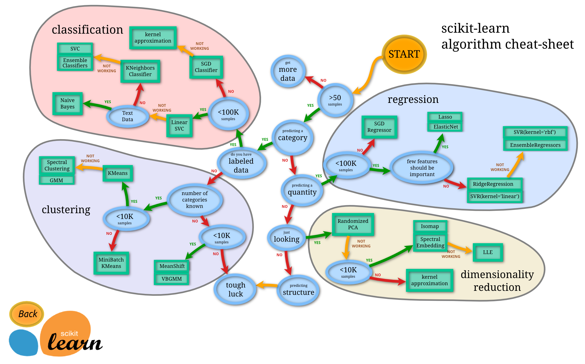

Last Change: 2020/01/25 13:38:08.

auther: tsuyo-pon

# VBGMM を使ってみよう!
やっぱり機械学習は，練習しないと覚えられません．

特に教師なし機械学習でクラスタリングなんて，自分で色々試行錯誤して算出しないとダメですね．

なので，まず機械学習のVBGMMなる奴を行います．




VBGMM は左下のエリアにいますね．

## Contents
1. データセットの準備
1. データの整形
1. 分布の確認
1. k-means の実施・確認
1. vbgmm の実施・確認
1. 各データのコンポーネントを確認
1. 各コンポーネントの重みを確認

## データセットの用意
[]({{{)
まずはデータセットを読み込みます．

誰がなんと言おうと，データがないとどうしようもないです(偉い人になんか言われたらどうしよう)．

今回は，scikit learn の wine データを使います．
[wine データ](https://archive.ics.uci.edu/ml/machine-learning-databases/wine/wine.data) (リンクを踏んだらダンロードされます) はすでに準備してあるので，読み込みましょう．

(`git clone` した人と，していない人で PATH が変わります．)
```
# 必要なライブラリをインポート
import pandas as pd

# wine データを読み込む (`git clone` した人)
df_wine_all = pd.read_csv("../data/wine.data", header=None,)

# wine データを読み込む (`git clone` していない人)
# df_wine_all=pd.read_csv("https://archive.ics.uci.edu/ml/machine-learning-databases/wine/wine.data", header=None)

# wine データを読み込む (`git clone` していないけど，wine データをダウンロードした人)
# df_wine_all=pd.read_csv("~/Downloads/wine.data", header=None)
```

これでひとまず分類に必要なデータセットを用意できました．
[](}}})

## データの整形
[]({{{)
全データを使ってもいいんですが，今回は教師なし機械学習での分類を**検証**したいので，データを絞りましょう．

教師なし学習を検証するために必要な教師情報 (品種: 0列)と，教師なし学習に必要な情報 (色: 10列, プロリンの量: 13列)を使います．
```
# 品種(0列、1～3)と色（10列）とプロリンの量(13列)を使用する
df_wine = df_wine_all[[0, 10, 13]]
df_wine.columns = [u"class", u"color", u"proline"]
pd.DataFrame(df_wine)  # この行を実行するとデータが見れる
```

これで，ひとまず分類するデータを用意できました．

データを正規化して実際の分析に臨みましょう

```
# 必要なライブラリをインポート
from sklearn import preprocessing

# データの正規化
X = df_wine[["color", "proline"]]
sc = preprocessing.StandardScaler()
sc.fit(X)
X_norm = sc.transform(X)
print(X_norm)
```
[](}}})

## 分布の確認
[]({{{)
分析するデータを手に入れたから，早速機械学習を...

### ちょっと待て!!!

データを手に入れたら解析を始める前に，**まず**分布を確認しよう (これは解析を始める前の癖にすることを強く勧めます)．

分布を確認して，明らかな外れ値があったり，あるいは自身の予想と全く異なる分布であったら，検討する必要があります．

```
# 必要なライブラリをインポート
import matplotlib.pyplot as plt

# 散布図の作成
x = X_norm[:, 0]
y = X_norm[:, 1]
z = df_wine["class"]

plt.figure(figsize=(10, 15))
plt.subplot(4, 1, 1)
plt.title("row data")
plt.scatter(x, y, c=z)
plt.show
```
[](}}})

## k-means の実施
[]({{{)
分布も確認したので，いよいよデータを分類していきましょう．

まずは教師なし分類手法で有名な k-means 法を行います．
k-means 法は，あらかじめ分類数を定める必要があります．

そのため，分類数に関わる仮説や教師データが存在しない場合，分類数を決定するのは大変です．
分類数ごとにモデルの良さを評価し，色々な分類数でモデルの良さを確認して，最も妥当な分類数を探索する必要があります (それをやってくれる x-means 法なるものがあるらしですが，今回は割愛)．

今回はあらかじめ教師情報があるので，分類数は "3" として行います．

```
# 必要なライブラリをインポート
from sklearn import cluster

# k-means 法で学習
km = cluster.KMeans(n_clusters=3)
z_km = km.fit(X_norm)
```

k-means 法で学習したので，結果を確認しましょう．
```
# 分類結果を表す散布図を確認
plt.subplot(4, 1, 2)
plt.scatter(x, y, c=z_km.labels_)
plt.scatter(
    z_km.cluster_centers_[:, 0],
    z_km.cluster_centers_[:, 1],
    s=250,
    marker="*",
    c="red",
)
plt.title("KMeans")
plt.show
```

[](}}})

## vbgmm の実施
[]({{{)
[](}}})

## vbgmm の確認
[]({{{)
[](}}})

## 各データのコンポーネントを確認
[]({{{)
[](}}})

## 各コンポーネントの重みを確認
[]({{{)
[](}}})
